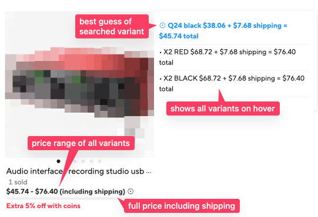
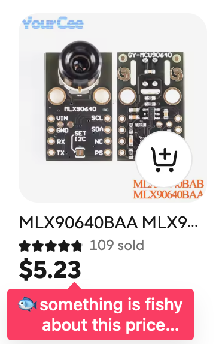
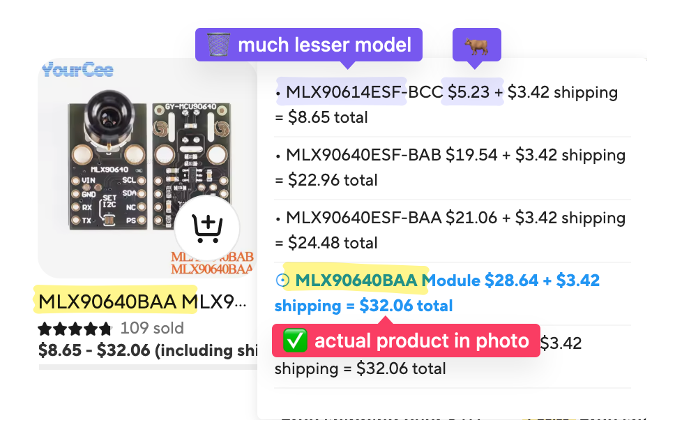

# AliExpress Real Price

A userscript that enhances AliExpress product listings by showing true prices including shipping costs and variant prices. This helps you avoid misleading listings where sellers put accessory variants as the primary price instead of the advertised item, or advertise the product cheaply but tack on shipping costs so the total price may be the same or even higher than competitors.

## Features

- Shows complete price ranges including shipping costs
- Displays shipping costs and free shipping thresholds
- Updates dynamically as you browse
- Identifies misleading prices from accessory variants
- Shows price distribution indicators
- Fast performance with smart caching
- Works on both aliexpress.com and aliexpress.us domains

## Screenshots

🤔🤔🤔🤔

## Installation

1. First, install a userscript manager extension in your browser:
   - [Tampermonkey](https://www.tampermonkey.net/) (Recommended)
   - [Greasemonkey](https://www.greasespot.net/)
   - [Violentmonkey](https://violentmonkey.github.io/)

2. Install the script by clicking this link: [Install AliExpress Real Price](aliexpress-real-price.user.js)

## Usage

The script works automatically when you browse AliExpress:

- Hover over prices to see detailed variant information
- Price ranges show the total cost including shipping
- A "⊙" indicator shows the most relevant price point
- Free shipping thresholds are displayed when available
- Status window displays progress in fetching prices
- Rate-limiting to avoid being blocked by the server

### Advanced Options

Click the 🐟 icon in the top-right corner to access advanced options:

- **Clear Cache**: Reset the price data cache
- **Disable Cache**: Turn off caching for real-time price fetching
- **Move Status Window**: You can drag the status window in case it's in the way.
## Troubleshooting

If you exceed the API rate limit, you may find the prices are not updating. You can open any product page, and Aliexpress will give you a CAPTCHA to solve. Once you do this, the script will continue working (you may need to refresh the page). You may need to do this periodically depending on your usage.

## How It Works

The script:
1. Detects product listings on the page
2. Fetches complete pricing data including all variants
3. Analyzes prices to identify the true main product cost
4. Shows comprehensive price information with shipping included
5. Updates dynamically as you scroll or navigate

## Privacy & Performance

- All processing happens locally in your browser
- Smart caching reduces API calls and improves performance
- No data is collected or sent to third parties
- Cache is cleared automatically after 24 hours

## Support

If you encounter any issues or have suggestions:
1. Check if you have the latest version installed
2. Clear the cache using the advanced options menu
3. [Create an issue](https://github.com/joshwand/aliexpress-real-price-userscript/issues) on GitHub

## License

This project is licensed under the GNU General Public License v3.0 - see the LICENSE file for details.

## Author

Created by Josh Wand
